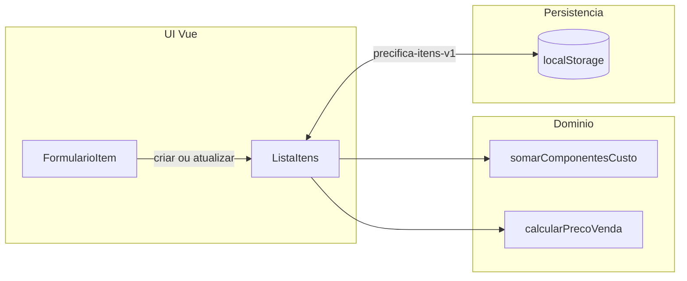

# Precifica

**Precifica** é uma aplicação web para ajudar a definir o **preço de venda sugerido** a partir da **composição do custo unitário** e de uma **margem percentual**. O objetivo é um fluxo simples no navegador: lançar os custos por componente, ver o total por unidade e o preço calculado.

O custo unitário é a **soma** de: matéria-prima/ingredientes, embalagem, taxas administrativas (rateio por unidade) e transporte (por unidade). A regra de negócio está em [`src/domain/precificacao.ts`](src/domain/precificacao.ts) e nos testes em [`src/domain/precificacao.spec.ts`](src/domain/precificacao.spec.ts).

### Precificação (política do MVP)

- **Componentes**: cada valor é em **reais por unidade**, maior ou igual a zero (campo vazio ou inválido é rejeitado).
- **Custo unitário**: soma dos quatro componentes (`somarComponentesCusto`).
- **Margem**: percentual entre **0** e **100**, aplicada **sobre o custo total** (markup).
- **Fórmula**: `preço sugerido = custo unitário × (1 + margem / 100)`.

### Fluxo de dados (MVP)



A lista é guardada automaticamente em **`localStorage`** (chave `precifica-itens-v1`): os dados ficam só neste navegador e podem ser apagados se limpar o armazenamento do site.

## Rodar localmente

```bash
npm install
npm run dev
```

Outros scripts úteis: `npm run build`, `npm run test`, `npm run lint`, `npm run preview` (pré-visualiza o build de produção).

## Como a IA apoiou

A IA foi usada como **apoio estrutural e de texto**, não como substituto de revisão humana:

- **Planejamento**: ajuda a organizar o MVP em fases, backlog por épicos e mensagens de commit no padrão *Conventional Commits*.
- **Boilerplate**: sugestão de comandos e estrutura inicial do projeto (por exemplo separação entre `vite.config.ts` e `vitest.config.ts` para evitar conflitos de tipos entre Vite e Vitest).
- **Documentação**: rascunho de README e descrição do repositório; o conteúdo foi **lido e ajustado** para refletir o que de fato foi feito e como o trabalho foi validado (`npm run build`, `npm run test`, `npm run lint`).

O que a IA **não** substitui: decisões de produto (regra de margem, limites de campos), revisão de fórmulas e garantia de que o código atende ao que você precisa entregar — isso continua sendo da sua validação e dos testes.
