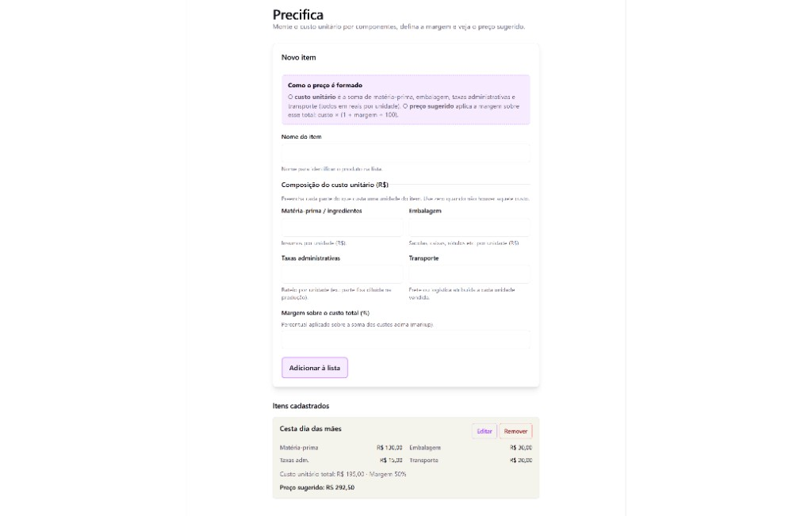
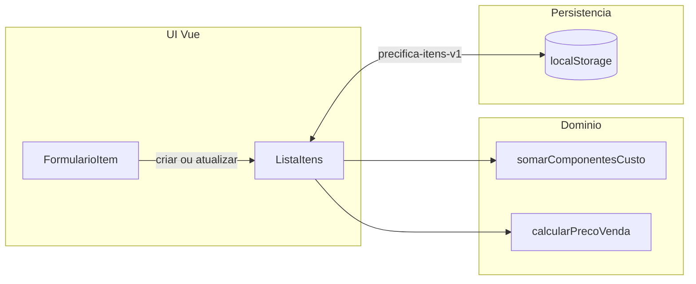

# Precifica

## Mini-projeto

**Precifica** é uma SPA **Vue 3 + Vite + TypeScript** (só front-end) para **precificar itens**: o custo unitário é a soma de **matéria-prima**, **embalagem**, **taxas administrativas** e **transporte**; a **margem (%)** aplica-se sobre esse total e gera o **preço de venda sugerido**. Inclui **CRUD**, **persistência em `localStorage`** e **testes** (Vitest).

### Captura de ecrã



## O que faz

O custo unitário é a **soma** dos quatro componentes em reais por unidade. A regra de negócio está em [`src/domain/precificacao.ts`](src/domain/precificacao.ts), a formatação em **BRL** em [`src/formato/brl.ts`](src/formato/brl.ts) (`Intl.NumberFormat`) e os testes de domínio em [`src/domain/precificacao.spec.ts`](src/domain/precificacao.spec.ts).

### Precificação (política do MVP)

- **Componentes**: cada valor ≥ 0 (campo vazio ou inválido é rejeitado).
- **Custo unitário**: `somarComponentesCusto` nos quatro campos.
- **Margem**: 0 a 100 %, **markup sobre o custo total**.
- **Fórmula**: `preço sugerido = custo unitário × (1 + margem / 100)`.

### Fluxo de dados (MVP)



A lista é guardada em **`localStorage`** (`precifica-itens-v1`): dados **só neste navegador**; limpar o armazenamento do site apaga os itens.

## Requisitos

- **Node.js** 20.x ou **22.x** (LTS recomendado), com **npm** 10+.

## Instalar e correr

```bash
npm install
npm run dev
```

(Na primeira vez, clona o repositório e entra na pasta do projeto antes de `npm install`.)

Abre o endereço que o Vite indicar (por defeito `http://localhost:5173`).

## Como testar e validar

```bash
npm run lint    # ESLint
npm run test    # Vitest (domínio, storage, componente)
npm run build   # vue-tsc + build de produção
npm run preview # opcional: pré-visualizar o build
```

Convém correr **lint**, **test** e **build** antes de abrir PR ou de entregar no fórum.

## CI no GitHub

O workflow [`.github/workflows/ci.yml`](.github/workflows/ci.yml) corre em **push/PR** para `main` e `develop`: `npm ci`, `npm run lint`, `npm run test`, `npm run build` (Node 22).

## Versionamento (Gitflow)

- Branches prefixadas: **`feat/`** (funcionalidade), **`test/`** (testes/qualidade), **`docs/`** (documentação); integração via PR para **`main`** / **`develop`** conforme o fluxo da equipa.
- **Tags semver** até **`v1.0.0`** para marcos estáveis do MVP.

## Como a IA apoiou

- **Planeamento**: fases, backlog, *Conventional Commits*.
- **Código**: boilerplate Vue/Vite, separação `vite.config` / `vitest.config`, módulo de persistência, sugestões de testes.
- **Documentação**: rascunhos de README; o resultado foi **revisto** para bater certo com o código.

**Validação humana:** prompts e patches da IA foram **testados** (`npm run test`, `npm run build`, revisão de fórmulas e limites). A IA **não** substitui decisão de produto nem revisão de regras de negócio.

## Desafios e decisões técnicas

- **Custo em componentes** em vez de um único campo de custo: modela melhor o mundo real, mas aumenta validação e UI.
- **Margem 0–100 %** como markup sobre o custo total; documentado no README para evitar ambiguidade com “margem sobre preço de venda”.
- **`localStorage` + Vitest:** `fileParallelism: false` no Vitest para evitar **corridas** entre ficheiros de teste no mesmo `localStorage`.
- **`watch` com `flush: 'sync'`** ao persistir itens, para a gravação ocorrer na mesma “voltagem” que a mutação (útil em testes e consistência).
- **Formatação BRL:** `Intl.NumberFormat('pt-BR', { style: 'currency', currency: 'BRL' })` centralizada em [`src/formato/brl.ts`](src/formato/brl.ts).
- **Acessibilidade:** `aria-labelledby` no formulário, `aria-describedby` / `aria-invalid` nos campos, `aria-label` nos botões da lista, `role="alert"` nos erros.
- **Mobile:** grelha responsiva, inputs com `font-size: 1rem` em ecrãs estreitos (reduz zoom no iOS), botões com altura mínima ~44px.

