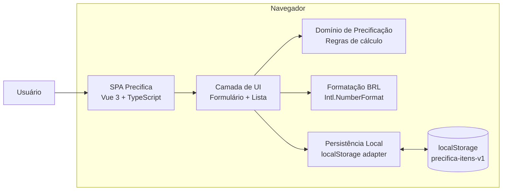
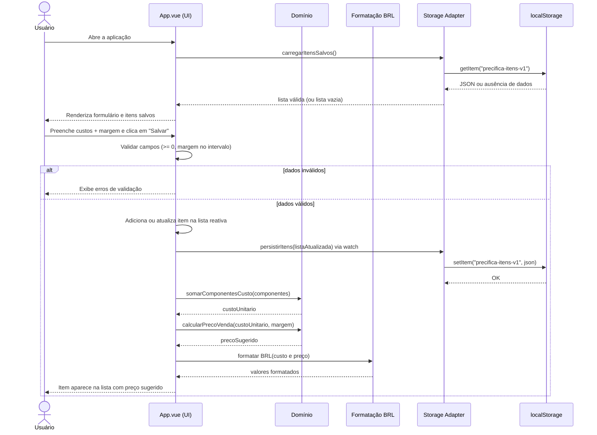

# Precifica

## Descrição do sistema em linguagem natural

### Escopo
**Precifica** é um MVP front-end para apoiar a precificação de itens a partir de uma composição de custos e de uma margem desejada. A aplicação permite:
- registrar itens com componentes de custo (matéria-prima, embalagem, taxas administrativas e transporte);
- calcular custo unitário total;
- aplicar margem (%) para sugerir preço de venda;
- listar, editar e remover itens;
- persistir os dados localmente no navegador.

### Nível da visão
Esta documentação adota uma visão de **containers/componentes de alto nível** (inspirada no C4), adequada para entender responsabilidades técnicas do MVP sem entrar em detalhes de implementação linha a linha.

### Limites e responsabilidades
- **Frontend SPA (Vue 3 + TypeScript)**
  - Orquestra estado da interface e jornadas de usuário (cadastro, edição, remoção).
  - Valida entradas básicas de formulário.
  - Aciona regras de negócio para cálculo e apresenta os resultados.
- **Módulo de domínio (`src/domain`)**
  - Centraliza as regras de cálculo de custo e preço sugerido.
  - Mantém a política de margem do MVP (markup sobre custo).
- **Módulo de formatação (`src/formato`)**
  - Formata valores monetários em BRL de forma consistente.
- **Módulo de persistência (`src/storage`)**
  - Salva e recupera itens em `localStorage` (chave `precifica-itens-v1`).
- **Fonte de verdade em runtime**
  - Durante a sessão, a lista reativa `itens` em `App.vue` é a fonte de verdade.
  - Ao iniciar, a lista é carregada do navegador; após cada alteração, um `watch` profundo persiste a lista.
  - O preço sugerido não é armazenado: é derivado da composição de custos e da margem quando a interface renderiza.
- **Sem backend neste MVP**
  - Não há API, banco relacional, autenticação, autorização ou multiusuário.

### Integrações
Integrações atuais são locais e de build/runtime:
- **Browser `localStorage`** para persistência no dispositivo do usuário;
- **Runtime Vue 3** para renderização reativa;
- **Tooling Vite/TypeScript** para build e desenvolvimento.

Não existem integrações externas com ERPs, gateways de pagamento, serviços fiscais, catálogos de produto ou autenticação de terceiros.

### Restrições
- Persistência limitada ao navegador/dispositivo atual;
- Ausência de sincronização entre dispositivos;
- Sem controle de concorrência e sem trilha de auditoria;
- Regras de cálculo focadas no cenário de markup simples (não contempla regimes tributários complexos);
- Dependência de conectividade apenas para carregar os assets (depois, lógica é local).

### Lacunas (gaps) para evolução
- Backend/API para armazenamento centralizado e histórico;
- Login e gestão de usuários/perfis;
- Catálogo de produtos, categorias e fornecedores;
- Simulações avançadas (impostos por regime, descontos, comissões, cenários); 
- Exportação/importação (CSV/Excel) e relatórios;
- Observabilidade (telemetria de uso e erros);
- Testes E2E e suíte de contrato para eventual API futura.

---

## Diagrama estrutural (visão de containers, inspirada no C4)

```mermaid
flowchart LR
  U[Usuário]

  subgraph B[Navegador]
    SPA[SPA Precifica<br/>Vue 3 + TypeScript]
    UI[Camada de UI<br/>Formulário + Lista]
    DOM[Domínio de Precificação<br/>Regras de cálculo]
    FMT[Formatação BRL<br/>Intl.NumberFormat]
    STG[Persistência Local<br/>localStorage adapter]
    LS[(localStorage<br/>precifica-itens-v1)]

    SPA --> UI
    UI --> DOM
    UI --> FMT
    UI --> STG
    STG <--> LS
  end

  U --> SPA
```

---

## Diagrama comportamental (sequência de jornada crítica)

Jornada crítica escolhida: **cadastrar item e obter preço sugerido persistido**.

```mermaid
sequenceDiagram
  actor U as Usuário
  participant UI as App.vue (UI)
  participant D as Domínio
  participant F as Formatação BRL
  participant S as Storage Adapter
  participant L as localStorage

  U->>UI: Abre a aplicação
  UI->>S: carregarItensSalvos()
  S->>L: getItem("precifica-itens-v1")
  L-->>S: JSON ou ausência de dados
  S-->>UI: lista válida (ou lista vazia)
  UI-->>U: Renderiza formulário e itens salvos
  U->>UI: Preenche custos + margem e clica em "Salvar"
  UI->>UI: Validar campos (>= 0, margem no intervalo)
  alt dados inválidos
    UI-->>U: Exibe erros de validação
  else dados válidos
    UI->>UI: Adiciona ou atualiza item na lista reativa
    UI->>S: persistirItens(listaAtualizada) via watch
    S->>L: setItem("precifica-itens-v1", json)
    L-->>S: OK
    UI->>D: somarComponentesCusto(componentes)
    D-->>UI: custoUnitario
    UI->>D: calcularPrecoVenda(custoUnitario, margem)
    D-->>UI: precoSugerido
    UI->>F: formatar BRL(custo e preço)
    F-->>UI: valores formatados
    UI-->>U: Item aparece na lista com preço sugerido
  end
```

---

## Decisões e ajustes sobre a geração por GenAI

Para chegar aos diagramas e descrição finais, os seguintes ajustes foram aplicados sobre uma geração inicial automática:

1. **Delimitação explícita de escopo**
   - Ajustado para deixar claro que o sistema é **MVP somente front-end**, sem backend.

2. **Refinamento de fronteiras arquiteturais**
   - Separação em responsabilidades: UI, domínio, formatação e persistência local.
   - Evitou-se sugerir componentes não existentes no código atual (ex.: API REST, banco servidor).

3. **Correção de semântica de negócio no fluxo**
   - Sequência alinhada à política documentada: preço sugerido por markup sobre custo.
   - Inclusão do caminho alternativo de validação inválida (erro para o usuário).
   - Fluxo ajustado para refletir o código: carregamento inicial, persistência reativa e cálculo derivado na renderização.

4. **Ajuste de nomenclatura técnica**
   - Termos padronizados para facilitar manutenção: “Domínio”, “Storage Adapter”, “localStorage key”.

5. **Foco em legibilidade de README**
   - Estrutura em blocos: descrição natural, estrutural, comportamental, decisões.
   - Mermaid mantido simples para renderização nativa no GitHub.

6. **Assunções registradas**
   - Onde não havia evidência de integrações externas, assumiu-se ausência e isso foi explicitado como limite/lacuna.
   - O diagrama representa `localStorage` como dependência do navegador, não como um banco compartilhado.

---

## Observação
Este README descreve a arquitetura **atual** do MVP. Caso o projeto evolua para backend/API, recomenda-se atualizar esta documentação com:
- visão C4 em níveis adicionais (Container e Component detalhados);
- diagrama de contexto com sistemas externos;
- novo diagrama de sequência para autenticação e sincronização de dados.
