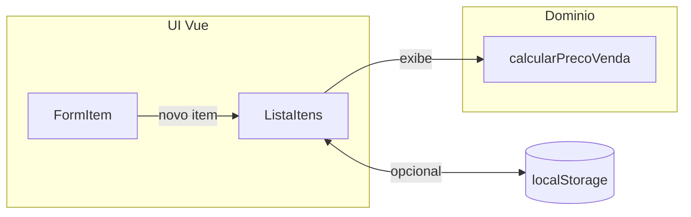

# MVP Vue 3 — precificação de itens (fases e commits)

## Objetivo do produto

Single Page App que permita cadastrar **itens** com **custo** e **margem (%)** (ou valor fixo de lucro, se preferir na Fase 2), calcular **preço de venda sugerido** no cliente, listar/editar/remover itens e (opcional) persistir em `localStorage`. Sem backend: regras e dados ficam no browser.

Isso atende bem o “mini-projeto” do fórum: repositório claro, README reproduzível, uso documentado de IA e espaço para falar de revisão e testes.

## Stack sugerida (enxuta)

- [Vue 3](https://vuejs.org/) + [Vite](https://vitejs.dev/) + **TypeScript**
- Estilos: **CSS scoped** ou uma camada mínima (ex.: variáveis CSS); evitar UI kit pesado no MVP
- Estado: começar com **Composition API + `ref`/`computed`**; introduzir **Pinia** só se uma fase dedicada “estado global” fizer sentido (commit separado)
- Testes: **Vitest** + **@vue/test-utils** para funções de precificação e componentes críticos
- Qualidade: **ESLint** (+ Prettier opcional), script `npm run build` sempre verde

## Modelo de dados e regra principal (MVP)

- Campos por item: `id`, `nome`, `custoUnitario` (número ≥ 0), `margemPercentual` (0–100 ou política que você definir no README)
- Fórmula base: `precoVenda = custoUnitario * (1 + margemPercentual / 100)` (ajustável se quiser margem sobre preço de venda — documente a escolha no README para evitar ambiguidade)

## Divisão em fases e commits incrementais

Cada fase = 1 ou mais **commits atômicos** (mensagens em português ou inglês, consistentes; prefixos `feat:`, `chore:`, `test:`, `docs:`).

| Fase | Entrega | Commits típicos (exemplos) |
|------|---------|----------------------------|
| **1 — Scaffold** | Repo inicial, Vite Vue TS, `.gitignore`, `package.json`, página vazia com título | `chore: inicializa projeto vite vue-ts`; `chore: adiciona eslint` |
| **2 — Domínio** | Tipos `Item`, função pura `calcularPrecoVenda`, testes unitários só da função | `feat: adiciona modelo e cálculo de preço`; `test: cobre cálculo de precificação` |
| **3 — UI mínima** | Formulário (nome, custo, margem), botão adicionar, lista com preço calculado, validação básica | `feat: formulário e lista de itens`; `fix: validação de inputs` |
| **4 — CRUD / persistência** | Editar, remover, opcional `localStorage` (hydrate on load) | `feat: editar e remover item`; `feat: persistência local` |
| **5 — Polimento** | Acessibilidade simples (labels, `aria`), formatação BRL (`Intl.NumberFormat`), layout responsivo leve | `feat: formatação monetária`; `style: layout responsivo` |
| **6 — Documentação e entrega** | README final: como rodar, escopo, decisões de precificação, **secção “Uso de IA”** (o que pediu, o que validou), **desafios** (org/docs/submissão), **como testar** | `docs: readme com instruções e reflexão sobre IA` |

Ordem intencional: **testes da regra de negócio antes ou junto da UI**, para o fórum você poder dizer que validou sugestões da IA com testes e revisão manual.

## README alinhado ao enunciado do fórum

Incluir seções explícitas (copiáveis para a postagem):

1. **Mini-projeto**: “Calculadora / gestor simples de precificação de itens (Vue 3, front-only).”
2. **Como a IA apoiou**: prompts, refatorações, geração de testes — sem copiar código opaco sem ler.
3. **Desafios**: escolha da fórmula de margem, formatação/locale, organização de commits, CI opcional (GitHub Actions com `npm ci` + `build` + `test`).
4. **Cuidados com sugestões da IA**: checagem de edge cases (zero, negativos bloqueados), `npm run build`/`test`, revisão de fórmulas e de segurança (nada de segredos no repo).

## Diagrama do fluxo de dados (MVP)

## O que não fazer no MVP (evita escopo inflado)

- Backend, login, multi-tenant
- Integração com este repositório Angular atual — manter **repositório Vue separado** (sua escolha)

## Após aprovação do plano (execução)

1. Criar pasta/repo local, `npm create vite@latest` (template Vue + TS).
2. Implementar fases na ordem da tabela, **um commit por mudança lógica**.
3. Subir para GitHub, garantir branch `main` com histórico legível.
4. Opcional: Action `.github/workflows/ci.yml` com `node` LTS, `npm ci`, `npm test`, `npm run build`.

## Referência para o texto do fórum

Na postagem, além do link: 2–3 frases sobre **estratégia de commits por fase**, **um desafio concreto** (ex.: definição de margem), e **uma validação** (ex.: teste que pegou erro numa sugestão da IA).
